# DevAcademy - Modern MERN Course Management System

## 📖 Overview

**DevAcademy** is a full-stack Course Management System (CMS) designed to bridge the gap between instructors and students. Built on the robust **MERN Stack** (MongoDB, Express, React, Node.js), it features a modern **Glassmorphism UI** and utilizes a unique **Hybrid Cloud Deployment** strategy for optimal performance and cost-efficiency.

The platform implements secure, **Role-Based Access Control (RBAC)**, providing distinct experiences for Administrators (Course Creation/Management) and Students (Enrollment/Tracking).

---

## 🌐 Live Demos

We provide primary and backup deployment links to ensure continuous access to the project.

| Role | Provider | Link & Status |
| :--- | :--- | :--- |
| **Primary** | **AWS S3** | [**🚀 Launch S3 Deployment**](http://cmsfront.s3-website.eu-north-1.amazonaws.com)<br>*(Demonstrates hybrid cloud architecture. May be unavailable during billing maintenance.)* |
| **Fallback**| **Vercel** | [**🛟 Launch Vercel Backup**](https://cms-three-zeta.vercel.app)<br>*(Use this reliable backup link if the primary S3 link is inaccessible.)* |

---

## ✨ Key Features

* [cite_start]**🛡️ Hybrid Cloud Architecture:** Frontend delivered at the edge via fast static hosting (S3/Vercel), while the backend runs on a scalable dynamic cloud service (Render) .
* [cite_start]**🎨 Modern Glassmorphism UI:** A premium, visually appealing interface designed with translucent elements, blurred backgrounds, and responsive grids .
* **🔐 Role-Based Access Control (RBAC):**
    * **Admins:** Secure access to Create, Edit, and Delete courses.
    * [cite_start]**Students:** Browse the catalog, enroll in courses, and track "My Learning" progress .
* [cite_start]**🔑 Secure Authentication:** Stateless authentication using **JSON Web Tokens (JWT)** with Bcrypt password hashing .
* [cite_start]**⚡ Smooth Interactions:** Enhanced user experience with fluid animations powered by **Framer Motion** .
* **📱 Responsive Design:** Fully optimized layout for desktop, tablet, and mobile devices.

---

## 🏗️ Architecture & Tech Stack

This project moves beyond the traditional single-server monolith by decoupling the frontend and backend across specialized cloud providers.

### System Flowchart

```mermaid
graph LR
    %% Define Nodes
    Browser("🖥️ User Browser
    (React Client)")
    S3["☁️ AWS S3 Bucket
    (Static Frontend)"]
    Render["🚀 Render Web Service
    (Node.js API)"]
    DB[("🍃 MongoDB Atlas
    (Database)")]

    %% Flow
    Browser -->|1. Request App| S3
    S3 -.->|2. Deliver Assets| Browser
    Browser -->|3. API Request| Render
    Render <-->|4. Query Data| DB
    Render -.->|5. API Response| Browser

    %% Styling
    style Browser fill:#E1F5FE,stroke:#0288D1
    style S3 fill:#FF9900,stroke:#E65100,color:white
    style Render fill:#46E3B7,stroke:#00BFA5
    style DB fill:#4DB33D,stroke:#33691E,color:white
```


### Technology Stack

| Area | Technology | Purpose |
| :--- | :--- | :--- |
| **Frontend** | **React.js (Vite)** | [cite_start]Component-based UI library for building the interactive dashboard[cite: 33]. |
| | **Bootstrap 5 + Custom CSS** | [cite_start]Responsive grid layout and custom Glassmorphism styling[cite: 40]. |
| | **Framer Motion** | [cite_start]Animation library for smooth entry and transition effects[cite: 34]. |
| **Backend** | **Node.js** | [cite_start]JavaScript runtime environment for server-side logic[cite: 35]. |
| | **Express.js** | [cite_start]Web framework for building the RESTful API endpoints[cite: 35]. |
| | **JSON Web Token (JWT)** | [cite_start]Secure, stateless authentication for user sessions[cite: 42]. |
| **Database** | **MongoDB Atlas** | [cite_start]Cloud-hosted NoSQL document database for flexible data storage[cite: 37]. |
| **Hosting** | **AWS S3** | [cite_start]Hosting static frontend assets (HTML/CSS/JS) for high speed and low cost[cite: 183]. |
| | **Render** | [cite_start]Hosting the dynamic Node.js backend service to prevent server sleep issues[cite: 187]. |
---

## 📸 Screenshots

| Admin Dashboard | Create Course Modal |
| :---: | :---: |
| ![Dashboard]| ![Create Course]|
| *Manage courses and view real-time stats* | *Intuitive form for adding new content* |


---

## 🛠️ Getting Started (Local Development)

Follow these steps to run the project locally on your machine.

### Prerequisites
* **Node.js** (v16 or higher) installed.
* A **MongoDB Atlas** connection URI.

### 1. Clone the Repository
```bash
git clone [https://github.com/FahimJamal07/mernint.git](https://github.com/FahimJamal07/mernint.git)
cd mernint
```

### 2. Backend Setup
Navigate to the backend folder and install the necessary dependencies:
```bash
cd cms/backend
npm install
```
Create a secure environment file:
```bash
touch .env
```
Open the .env file and paste your configuration:
```bash
PORT=5000
MONGO_URI=your_mongodb_connection_string_here
JWT_SECRET=your_super_secret_key_here
```
Start the backend server:
```bash
npm run dev
# The server will start on http://localhost:5000
```

### 3. Frontend Setup
Open a new terminal window (keep the backend running) and go to the frontend folder:
```bash
cd frontend
npm install
```
⚠️ Important Configuration Step: To run locally, you must point the frontend to your local server instead of Render. Open src/pages/Dashboard.jsx (and CourseForm.jsx) and update the helper function:
```JavaScript
// Change this function to return localhost
const getBaseUrl = () => {
    return 'http://localhost:5000';
};
```
Start the React development server:
```bash
npm run dev
# The frontend will launch at http://localhost:5173
```

## 📡 API Documentation

The backend exposes a RESTful API. Below are the primary endpoints available in the application.

### Authentication
| Method | Endpoint | Description | Auth Required |
| :--- | :--- | :--- | :--- |
| `POST` | `/api/auth/register` | Register a new user (Default role: Student) | No |
| `POST` | `/api/auth/login` | Authenticate user and receive a JWT Token | No |
| `GET` | `/api/auth/me` | Get the profile of the currently logged-in user | **Yes (JWT)** |

### Courses
| Method | Endpoint | Description | Auth Required |
| :--- | :--- | :--- | :--- |
| `GET` | `/api/courses` | Fetch a list of all available courses | No |
| `POST` | `/api/courses` | Create a new course (Admin only) | **Yes (Admin)** |
| `PUT` | `/api/courses/:id` | Update an existing course details | **Yes (Admin)** |
| `DELETE` | `/api/courses/:id` | Delete a course permanently | **Yes (Admin)** |

### Enrollment (Future Scope)
| Method | Endpoint | Description | Auth Required |
| :--- | :--- | :--- | :--- |
| `POST` | `/api/enroll/:id` | Enroll a student in a specific course | **Yes (Student)** |

## 📄 License

This project is open source 

---

## 👤 Author

**Mohamed Fahim Jamal**

* 🐙 **GitHub:** [@FahimJamal07](https://github.com/FahimJamal07)
* 💼 **LinkedIn:** [www.linkedin.com/in/mohamed-fahim-jamal-379422328](www.linkedin.com/in/mohamed-fahim-jamal-379422328)
* 📧 **Email:** [fahimjamal838@gmail.com](mailto:fahimjamal838@gmail.com)

---

### ⭐️ Show your support

Give a ⭐️ if this project helped you!


